Версия `1.0`

### 1. Общее описание:

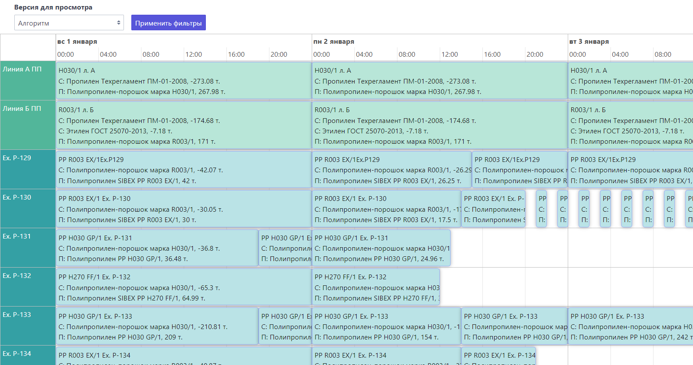

В верхней левой части интерфейса отображается фильтр версий для просмотра и кнопка применения.

Ниже расположен непосредственно блок планировщика (scheduler), который показывает задачи/события, распределенные по времени и по производственным линиям.

### 2. Интерфейс и возможности пользователя:

1.  Переходя по ссылке пользователь видит данные первого элемента фильтра `Версия для просмотра` по-умолчанию. (В дальнейшем при выборе опции фильтра - сохраняется выбор) 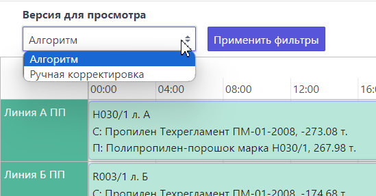

    и начальную временную точку самой первой производственной задачи
    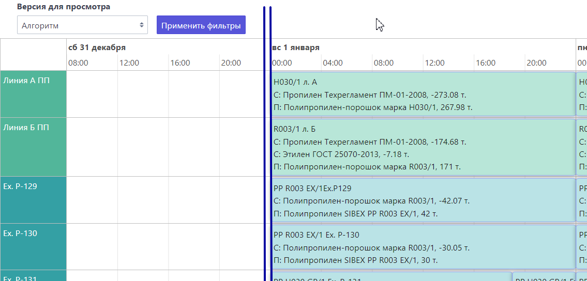

2.  Первая колонка графика - это производственные линии (элементы `groups`). Высота `fixed` и зависит от `content` событий на данной линии, вертикальная прокрутка таблицы настроена при наведении курсора на поле данной колонки  
    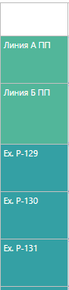
3.  В шапке таблицы находится временная шкала с двумя строчками по логике `parent` -> `child`:
    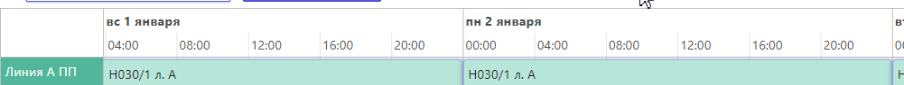
    минимальная детализация настроена до минуты
    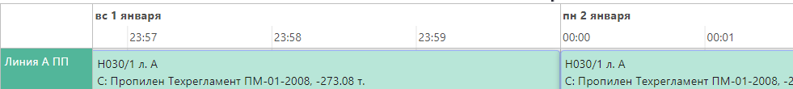
    ограничение максимальной детализации отключено опционально для удобства для данной модели
    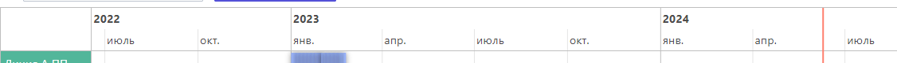
    возможность zoom настроена по комбинации `wheel`+`ctrlKey`

4.  В строчках таблицы расположены задачи/события (элементы `items`) сгруппированные по линиям, границы каждой задачи это `start` и `end` временных точек. Реализованные возможности:

-   перемещение элементов горизонтально в пределах дня в зависимоти от начала и окончания задачи/события с подтверждением и возвратом в первоначальное положение при отклонении. (Перемещение между линиями отключено опционально для данной модели)
    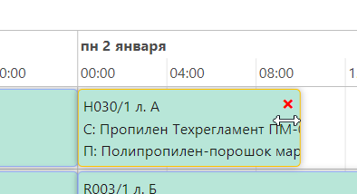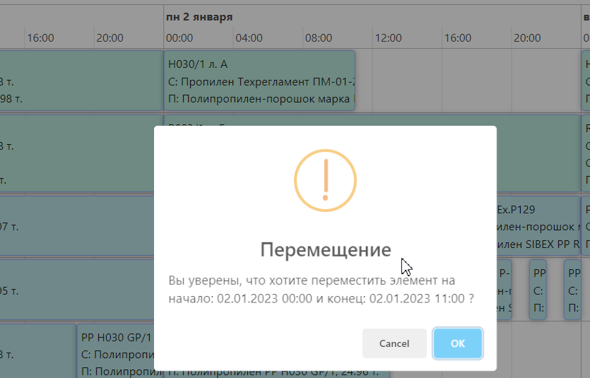
-   удаление элементов с подтверждением и возвратом в первоначальное положение при отклонении.
    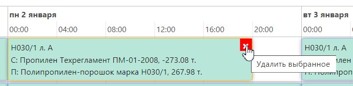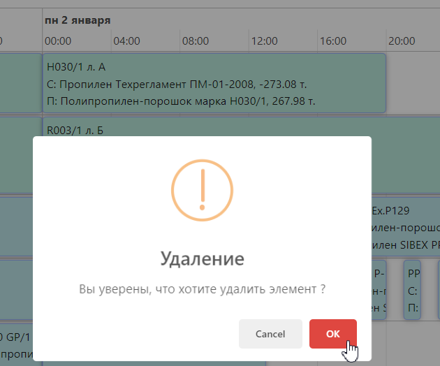
-   выделение и снятие выделения по `click` на элемент
-   горизонтальная прокрутка таблицы настроена на `wheel` при наведении курсора на поле задач/событий
-   при выделении элементов (особенно удобно если небольшой временной интервал) появляется `popover` (всплывающие элементы) с полным содержанием
    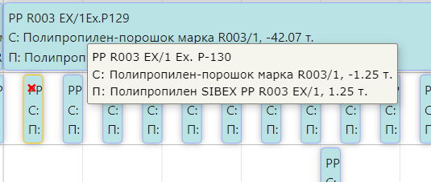
-   все корректировки записываются в модель и возможны для просмотра при выборе фильтра `Ручная корректировка`

    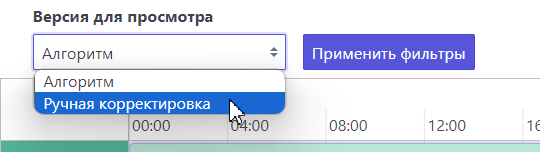

### 3. Кратко об архитектуре приложения:

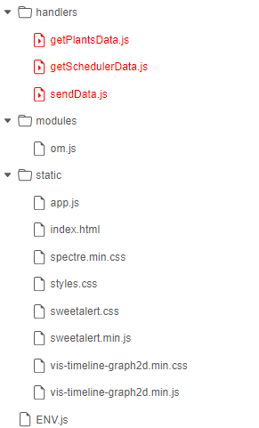

-   источники данных представлены в `ENV.js`
-   приложение реализовано с применением 3 `webhandlers`
-   реализовано параллельное чтение данных по `groups` и `items` из модели
-   цветовые параметры `groups` и `items` передаются из модели и доступны для настройки пользователям
-   запись данных в модель с форматированием даты и времени под форматы ОМ для облегчения мэппинга и дальнейших пересчетов в модели
-   запись данных в модель при корректировках реализовано по составному `id` элемента `group[longId].item[longId]`
-   график строится `new vis.Timeline(container, items, groups, options)` где:

    `container` - содержит ссылку на DOM-элемент `

`

    `items` - это данные, которые отображаются на временной шкале (события/задачи)

    `groups`- группы элементы на временной шкале (установки)

    `options` - это параметры конфигурации временной шкалы, которые позволяют настраивать внешний вид и поведение элементов.

### 4. Ресурсы, используемые при разработке (библиотеки, фреймворки):

-   [Vis-timeline](https://visjs.github.io/vis-timeline/) для создания временной шкалы (timeline) и элементов
-   CSS [Spectre.css](https://github.com/picturepan2/spectre)
-   Уведомления [SweetAlert](https://sweetalert.js.org/)
